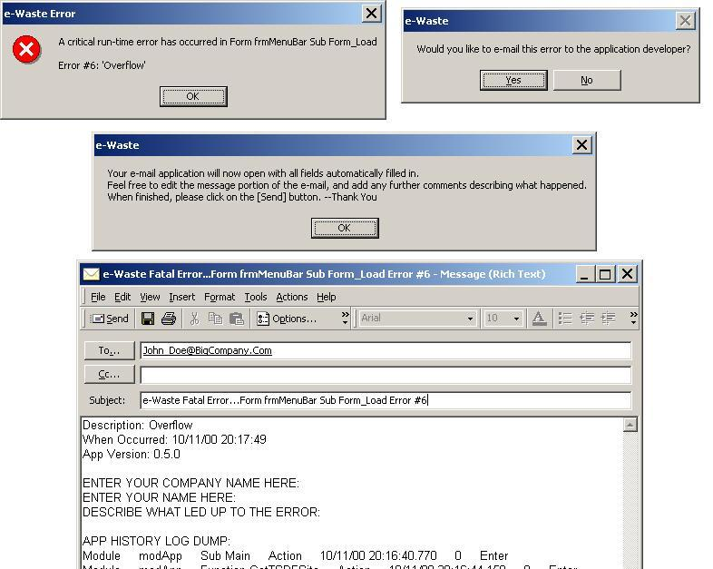

<div align="center">

## Powerful & Flexible Application Logger & Error Handler


</div>

### Description

This class, written by James Boyd, is a logger/error handler that does many things:

1.) Displays errors to users when they occur

2.) Records the activities of the application as various subroutines get executed

3.) When a run-time error happens, it can fire off an e-mail to the developer, replete with

routine name, error description, and even a dump of the app's execution stack at that point

4.) It can also maintain a text file which has the application's execution stack history

There are two ways of using this error handling/logging class:

1.) Use it just for error trapping

2.) Use it also for logging the execution path of an application. Since it captures the exact occurrence of a logged activity down to the THOUSANDTH of a second, it can be extremely useful for performing performance/efficiency analysis on subroutines.
 
### More Info
 
The primary public method is ".Log", where you can supply the necessary and optional parameters. It's designed to be very easy to use, and as unencumbering as possible when installing error-handling or application logging throuhgout your code.

This is a class, and for optimum usage, should be a global object. This allows you to use CAppLog whenever and wherever you want throughout all of the code in your forms, general modules, classes, active reports, etc.

Logs application activities and/or errors, and displays elegant user error messages. It can also e-mail the author when a run-time error is trapped, and also logs all activities and errors to an external text file.

You will be forced to be a better coder! CAppLog will help you toward this goal.


<span>             |<span>
---                |---
**Submitted On**   |2000-10-11 23:35:22
**By**             |[James Boyd](https://github.com/Planet-Source-Code/PSCIndex/blob/master/ByAuthor/james-boyd.md)
**Level**          |Intermediate
**User Rating**    |4.8 (81 globes from 17 users)
**Compatibility**  |VB 4\.0 \(32\-bit\), VB 5\.0, VB 6\.0
**Category**       |[Coding Standards](https://github.com/Planet-Source-Code/PSCIndex/blob/master/ByCategory/coding-standards__1-43.md)
**World**          |[Visual Basic](https://github.com/Planet-Source-Code/PSCIndex/blob/master/ByWorld/visual-basic.md)
**Archive File**   |[CODE\_UPLOAD1060610122000\.zip](https://github.com/Planet-Source-Code/james-boyd-powerful-flexible-application-logger-error-handler__1-12017/archive/master.zip)

### API Declarations

```
Private Declare Function ShellExecute Lib "shell32.dll" Alias "ShellExecuteA" (ByVal hWnd As Long, ByVal lpOperation As String, ByVal lpFile As String, ByVal lpParameters As String, ByVal lpDirectory As String, ByVal nShowCmd As Long) As Long
Private Declare Function GetDesktopWindow Lib "user32" () As Long
```


